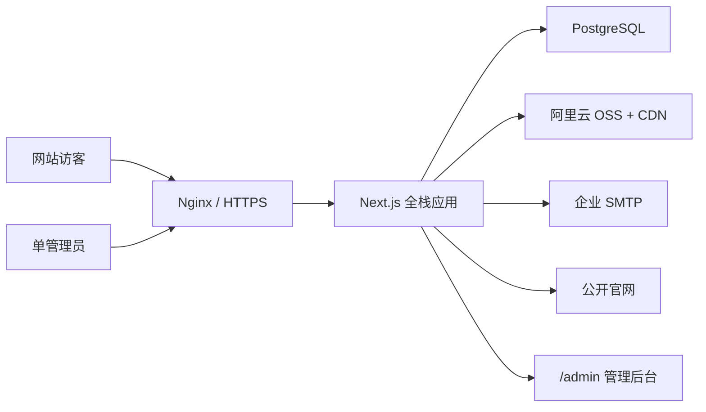

# Rongelec 企业官网与内容后台设计方案

日期：2026-08-19

## 1. 项目目标

将现有的单文件静态官网重构为可长期运营的中英双语企业官网，并增加单管理员内容后台。公开站继续服务南通睦融电气设备有限公司的品牌展示、海事电气服务介绍和客户咨询；后台负责固定页面、服务案例和媒体素材的维护。

第一期成功标准：

- `rongelec.com` 同时提供中文和英文内容。
- 首页、服务、关于、联系等固定页面可由管理员维护。
- 支持至少 100 条服务案例，提供分页列表和独立详情页。
- 客户联系表单直接发送到指定企业邮箱，不建设工单、CRM 或线索管理模块。
- 手机、iPad、笔记本和桌面屏幕均有专门布局，不通过整页缩放适配。
- 首页保留有声视频动画及声音开关，同时满足首屏性能指标。
- 网站可使用 Docker 部署到现有阿里云服务器，媒体由阿里云 OSS 与 CDN 提供。

## 2. 第一阶段范围

### 2.1 公开官网

- 首页
- 服务列表与服务详情
- 服务案例列表与案例详情
- 关于我们
- 联系我们与服务申请表单
- 中文、英文切换
- SEO 元数据、站点地图、搜索引擎结构化信息

### 2.2 管理后台

- 单管理员登录、退出和修改密码
- 首页、服务、关于、联系页面内容维护
- 服务案例新建、编辑、预览、发布、下架和排序
- 中英文内容完整性校验
- 图片、视频和案例相册素材管理
- 公司联系方式、收件邮箱和基础 SEO 设置

### 2.3 明确不做

- 新闻动态
- 多管理员、多角色和审批流
- 客户门户
- 报价、工单、派工和工程师进度
- 备件库存与 CRM
- 后台客户留言列表；咨询内容以企业邮箱为准

## 3. 技术架构

采用一个 Next.js 全栈应用，同时承载公开官网、管理员后台和服务端 API。这样既保留前端与后台的清晰边界，又只需维护一个代码库和一个应用容器。

核心技术：

- 前端与服务端：Next.js App Router、React、TypeScript
- 样式：Tailwind CSS，延续现有睦融蓝、红和海事工业视觉体系
- 数据库：PostgreSQL
- 数据访问：Prisma
- 管理员会话：成熟的服务端会话认证方案，使用安全 Cookie
- 富文本：结构化富文本编辑器，用于案例正文和图文内容
- 媒体：阿里云 OSS 原图/视频存储，CDN 分发
- 邮件：企业 SMTP 服务，收件地址通过环境变量配置
- 部署：Docker Compose、Nginx、HTTPS
- 测试：Vitest、Playwright、Lighthouse



## 4. 代码与模块边界

建议目录：

```text
src/
  app/
    [locale]/
      page.tsx
      services/
      cases/
      about/
      contact/
    admin/
      login/
      content/
      services/
      cases/
      media/
      settings/
    api/
      admin/
      contact/
      media/
  components/
    public/
    admin/
    ui/
  features/
    content/
    services/
    cases/
    media/
    contact/
    auth/
  lib/
    db/
    oss/
    mail/
    validation/
    security/
  styles/
prisma/
  schema.prisma
  migrations/
public/
tests/
  unit/
  integration/
  e2e/
```

每个 `features` 模块只负责一个业务领域；公开页面和后台页面调用相同的服务层，不直接复制数据库逻辑。现有 `test-last.html` 作为视觉与内容迁移来源，在新站验收完成前保留，不直接继续扩写。

## 5. 路由与页面跳转

中文为默认语言，公开路由显式携带语言前缀：

- `/zh`、`/en`
- `/zh/services`、`/en/services`
- `/zh/services/[slug]`、`/en/services/[slug]`
- `/zh/cases?page=1`、`/en/cases?page=1`
- `/zh/cases/[slug]`、`/en/cases/[slug]`
- `/zh/about`、`/en/about`
- `/zh/contact`、`/en/contact`
- `/admin/login` 与受保护的 `/admin/*`

案例列表公开端每页显示 12 条，后台每页显示 20 条。页面跳转使用 Next.js 链接预加载，支持浏览器返回、收藏、分享和搜索引擎直接访问。每条案例使用稳定的英文友好 `slug`，中英文页面共用同一 `slug`，但展示各自语言内容。

当某条案例未发布、已下架或不存在时返回标准 404。中英文任一版本缺少必填内容时，后台禁止发布，避免用户进入空白翻译页面。

## 6. 内容与数据模型

### 6.1 管理员

`AdminUser` 保存邮箱、密码哈希、密码更新时间和最后登录时间。第一期只允许一个有效管理员账号，不引入角色表。

### 6.2 固定页面

`PageSection` 按 `pageKey + sectionKey + locale` 保存页面区块。内容使用经过校验的结构化 JSON，而不是让管理员直接编辑 HTML。它支持首页横幅、欢迎语、服务摘要、船型、优势、公司介绍、联系信息和页脚等现有内容。

### 6.3 服务

`Service` 保存稳定标识、排序、发布状态和封面素材；`ServiceTranslation` 分别保存中文和英文标题、摘要、正文、SEO 标题与描述。

### 6.4 服务案例

`CaseStudy` 保存：

- 稳定 `slug`
- 草稿、已发布、已下架状态
- 发布时间
- 是否首页推荐
- 服务分类与船型分类
- 封面素材
- 案例相册顺序

`CaseTranslation` 分别保存中文和英文标题、摘要、项目背景、问题、解决方案、成果、SEO 标题与描述。`CaseMedia` 管理案例图片与排序，图片替代文本同时提供中英文。

100 条案例对 PostgreSQL 和服务端分页属于很小的数据量。数据库为 `status + publishedAt`、`slug` 和分类字段建立索引，列表请求只返回当前页所需字段。

### 6.5 媒体

`MediaAsset` 只保存 OSS 对象键、媒体类型、尺寸、时长、封面关系和中英文替代文本。数据库不存储图片或视频二进制内容。

## 7. 管理后台体验

后台导航：

- 概览：页面、服务、案例和媒体数量
- 页面内容：首页、关于、联系与页脚设置
- 服务管理：服务内容与排序
- 案例管理：筛选、分页、编辑、预览、发布和下架
- 媒体库：图片、视频和封面素材
- 网站设置：公司信息、企业邮箱、SEO 默认值、管理员密码

案例编辑器采用“基础信息、中文内容、英文内容、媒体、SEO、发布”分区。发布前显示校验结果；只有中英文必填字段、封面和 `slug` 完整时才允许发布。预览使用临时签名地址，不会让草稿被搜索引擎发现。

## 8. 响应式设计

采用移动优先设计，不使用固定页面宽度或 `transform: scale()` 缩放整页。

- 360–639px：单列案例、折叠菜单、紧凑首屏、触控优先
- 640–767px：大屏手机优化
- 768–1023px：iPad 双列案例、横竖屏布局和紧凑导航
- 1024–1279px：小型电脑三列案例和完整导航
- 1280px 以上：限制正文最大宽度，扩大留白而不是无限拉伸内容

字体使用流式尺寸，容器使用弹性宽度，图片使用稳定宽高比。交互目标至少 44×44px。重点测试 360、390、430、768、820、1024、1280、1440 和 1920px 宽度，并覆盖 iPad 横竖屏。

## 9. 图片与视频性能

### 9.1 已发现的根因

- 首页视频 `murong-mv.mp4` 约 9.8MB，目前直接自动播放，没有轻量封面或延迟加载策略。
- 项目中存在约 2.2–2.4MB、宽度超过 5500px 的原始图片。
- 当前图片没有统一的响应式尺寸、懒加载、宽高占位和现代格式策略。
- 部分素材来自 Unsplash、Wikimedia 等海外源，国内网络访问可能不稳定。

用户将把需要保留的海外素材下载后放入阿里云 OSS，并通过 CDN 分发。新站不在运行时依赖海外图片地址。

### 9.2 图片策略

- OSS 保存原图，CDN 根据请求提供合适尺寸和格式。
- 页面使用响应式 `srcset/sizes` 或等价的 OSS 图片处理参数。
- 优先 AVIF/WebP，兼容回退到 JPEG/PNG。
- 首屏关键图片预加载，其余图片默认懒加载。
- 每张图片必须保存宽高，防止布局跳动。
- 案例列表只请求缩略图；进入详情页后再加载正文与相册图片。
- 管理后台上传时校验类型、文件大小和像素尺寸。

### 9.3 首页有声视频策略

保留视频声音和声音开关。浏览器初次进入时必须静音自动播放；用户点击按钮后开启声音，再次点击关闭。按钮同时支持触屏、鼠标、键盘和无障碍状态提示。

视频交付版本：

- 原始有声母版：仅归档在 OSS，不直接用于网页首屏。
- 电脑发布版：1080p，保留 AAC 音轨，目标文件约 5MB；实际以肉眼画质验收为先，不强行压缩到失真。
- 手机发布版：720p，保留 AAC 音轨，目标文件约 2.5MB。
- 轻量封面：AVIF/WebP，目标不超过 150KB。

加载顺序：

1. 立即返回 HTML、导航、标题与视频封面。
2. 首屏稳定显示后，按设备加载对应视频版本并渐入播放。
3. 省流量、慢速网络或系统开启“减少动态效果”时仅显示封面。
4. 视频离开视口、页面隐藏或标签切换时暂停，返回后按状态恢复。
5. 使用 `muted`、`playsInline` 等兼容策略满足 iOS 和主流浏览器规则。

性能预算不是牺牲画质的硬限制。实施时保留母版，基于视频时长和画面运动复杂度调整码率，并用真实设备检查海面、船体、电气设备等细节是否出现明显色带或块状失真。

## 10. 联系表单与邮件

表单保留现有字段：姓名、公司名称、联系电话/邮箱、船舶信息及故障描述。

数据流：

1. 浏览器进行基础必填校验。
2. 服务端再次校验长度、格式和非法内容。
3. Nginx 与应用按 IP 限流，并使用隐藏蜜罐字段阻挡自动脚本。
4. API 通过 SMTP 发送中英文格式邮件到 `CONTACT_RECIPIENT_EMAIL`。
5. SMTP 返回成功后页面才显示“提交成功”。
6. 发送失败时显示明确错误、企业电话和公开邮箱，允许客户改用直接联系。

第一期不在数据库保存客户留言正文，不建设后台线索列表。应用日志只记录请求编号、时间和发送结果，不记录完整个人信息或故障描述。

## 11. SEO 与可访问性

- 每个语言页面拥有独立标题、描述、Canonical 与 `hreflang`。
- 自动生成包含全部已发布案例的 XML Sitemap。
- 草稿、后台和预览页面使用 `noindex`。
- 首页输出企业组织信息；服务页输出服务结构化数据；案例页输出适合的文章型结构化数据。
- 图片必须提供中英文替代文本。
- 页面语义结构、焦点顺序、颜色对比度和键盘操作满足常见无障碍要求。
- 语言切换保持当前页面语义，例如中文案例详情切换到同一案例英文版。

## 12. 安全设计

- 管理员密码使用强哈希存储，禁止明文和硬编码密码。
- 会话 Cookie 使用 `HttpOnly`、`Secure` 和合适的 `SameSite` 设置。
- 登录接口限流；连续失败触发短期冷却。
- 管理后台和写操作执行 CSRF 防护与服务端权限校验。
- 富文本在服务端清洗，防止 XSS。
- OSS 上传使用短期签名，限制文件类型、大小和对象路径。
- 数据库、SMTP、OSS 密钥只通过服务器环境变量注入。
- Nginx 设置安全响应头，HTTPS 全站强制跳转。

## 13. 错误与降级

- 视频加载失败：始终保留封面、标题和主要按钮，不影响首页使用。
- 图片加载失败：显示与版面一致的占位图，不导致页面塌陷。
- 邮件发送失败：不显示假成功，提供电话和邮箱备用渠道。
- 数据库短暂异常：公开页面返回友好错误页；静态缓存内容在可用时继续服务。
- 中英文内容不完整：后台阻止发布。
- OSS/CDN 异常：记录可追踪错误，不暴露密钥或内部堆栈。

## 14. 部署与运维

初始部署使用现有阿里云服务器：

- Nginx：域名、HTTPS、静态缓存、压缩、限流和反向代理
- Next.js Docker 容器：公开站、后台和 API
- PostgreSQL：同服务器独立容器与持久化卷；业务增长后可无缝迁移阿里云 RDS
- OSS/CDN：图片、视频及衍生媒体
- SMTP：企业邮件投递

数据库每天备份并加密上传到独立 OSS 备份路径，保留 30 天；每月至少执行一次恢复验证。部署采用可回滚镜像版本，新站验收完成前保留旧静态站备份。正式切换时先验证 HTTPS、数据库、OSS、邮件与手机访问，再更新域名流量。

必要环境配置包括数据库连接、管理员初始化邮箱、会话密钥、OSS/CDN 信息、SMTP 凭据和 `CONTACT_RECIPIENT_EMAIL`。具体值由部署人员在服务器配置，不写入 Git。

## 15. 测试与验收

### 15.1 自动化测试

- 单元测试：内容校验、语言完整性、分页、slug、邮件字段与媒体规则
- 集成测试：管理员登录、案例 CRUD、发布状态、数据库和邮件适配器
- 端到端测试：管理员创建双语案例并发布，访客从列表进入详情，语言切换保持同一案例，联系表单成功与失败路径
- 响应式测试：手机、iPad 横竖屏、笔记本和桌面截图比对
- 100 条案例种子数据测试：列表分页、详情访问、后台筛选和查询性能

### 15.2 性能验收

- 移动端 LCP 目标不超过 2.5 秒
- CLS 不超过 0.1
- INP 目标不超过 200ms
- 视频未完成下载时，首屏文字、封面和主要按钮仍可立即使用
- 手机不请求电脑 1080p 视频或超大原图
- 案例列表不一次下载 100 条正文和全部相册

### 15.3 功能验收

- 中文和英文页面完整可用
- 100 条案例可稳定分页、访问详情、发布和下架
- 管理员以一个账号完成全部内容维护
- 表单邮件能够到达指定企业邮箱，失败路径可见且可恢复
- iPhone、主流 Android、iPad、Safari、Chrome 和 Edge 的关键流程通过

## 16. 实施顺序

1. 备份现有站点并建立 Next.js、数据库与测试基础。
2. 建立双语内容模型、管理员认证和后台外壳。
3. 将现有首页、服务、关于、联系内容拆分为可维护组件并迁移。
4. 实现服务案例模型、后台编辑、分页列表和详情页。
5. 接入 OSS/CDN 媒体库与响应式图片处理。
6. 制作视频封面和手机/电脑有声发布版本，接入延迟播放与声音按钮。
7. 接入联系表单、SMTP、限流和失败降级。
8. 完成 SEO、无障碍、响应式和性能优化。
9. 执行自动化测试、真实设备验收、备份恢复演练和阿里云部署。
10. 通过验收后切换 `rongelec.com`，保留旧站回滚入口。

## 17. 最终决策摘要

- 使用方案 1：Next.js 单体全栈，而不是拆成三个独立应用。
- 单管理员，不设计角色和审批流。
- 公开内容全部提供中文和英文版本。
- 增加服务案例，不增加新闻动态。
- 100 条案例使用服务端分页和独立详情页。
- 联系表单只发送企业邮箱，不建设线索后台。
- 阿里云服务器部署，OSS/CDN 承载所有公开媒体。
- 首页保留有声视频和声音按钮，采用封面先行、设备分档和弱网降级。
- 响应式覆盖手机、iPad、笔记本与桌面，不使用整页缩放。
