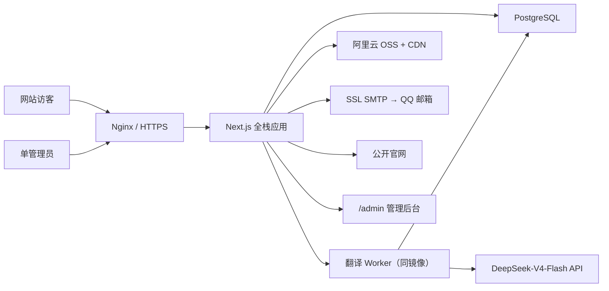

# Rongelec 企业官网与内容后台设计方案

日期：2026-08-19

## 1. 项目目标

将现有的单文件静态官网重构为可长期运营的中英双语企业官网，并增加单管理员内容后台。公开站继续服务南通睦融电气设备有限公司的品牌展示、海事电气服务介绍和客户咨询；后台负责固定页面、服务案例和媒体素材的维护。

第一期成功标准：

- `rongelec.com` 同时提供中文和英文内容。
- 首页、服务、关于、联系等固定页面可由管理员维护。
- 服务案例可逐步增长到至少 100 条，提供分页列表和独立详情页；第一期不做批量导入。
- 客户联系表单通过后端接口投递到指定 QQ 邮箱，不建设工单、CRM 或线索管理模块。
- 手机、iPad、笔记本和桌面屏幕均有专门布局，不通过整页缩放适配。
- 首页保留有声视频动画及声音开关，同时满足首屏性能指标。
- 网站可使用 Docker 部署到现有阿里云服务器，媒体由阿里云 OSS 与 CDN 提供。

## 2. 第一阶段范围

### 2.1 公开官网

- 首页
- 服务列表与服务详情
- 服务案例列表与案例详情
- 关于我们
- 联系我们与服务申请表单；页面显示地图地点，地图 API 由用户自行接入
- 中文、英文切换
- SEO 元数据、站点地图、搜索引擎结构化信息

### 2.2 管理后台

- 单管理员登录、退出和修改密码
- 首页、服务、关于、联系页面内容维护
- 服务案例新建、编辑、预览、发布、下架和排序
- 中英文内容完整性校验
- 图片、视频和案例相册素材管理
- 后台所有页面文本均提供中英文富文本编辑框，包括首页、服务、关于、联系、页脚、隐私政策、服务条款和案例正文；支持字体、字号、颜色、对齐、列表、链接、图片和表格
- 公司联系方式、收件邮箱和基础 SEO 设置

### 2.3 明确不做

- 新闻动态
- 多管理员、多角色和审批流
- 客户门户
- 报价、工单、派工和工程师进度
- 备件库存与 CRM
- 后台客户留言列表；咨询内容以企业邮箱为准
- Excel/CSV 案例批量导入；案例按日常需要逐条创建和维护

## 3. 技术架构

采用一个 Next.js 全栈应用，同时承载公开官网、管理员后台和服务端 API。这样既保留前端与后台的清晰边界，又只需维护一个代码库和一个应用容器。

核心技术：

- 前端与服务端：Next.js App Router、React、TypeScript
- 样式：Tailwind CSS，延续现有睦融蓝、红和海事工业视觉体系
- 数据库：PostgreSQL
- 数据访问：Prisma
- 管理员会话：成熟的服务端会话认证方案，使用安全 Cookie
- 富文本：结构化富文本编辑器，用于后台所有可维护的页面文本和案例正文
- AI 翻译：DeepSeek-V4-Flash 仅生成英文草稿；采用国际海事英语与英式拼写，管理员确认后才发布
- 异步任务：PostgreSQL 轻量翻译队列、同镜像单 Worker 和后台短轮询；不引入 Redis、RabbitMQ 或 WebSocket
- 媒体：阿里云 OSS 原图/视频存储，CDN 分发
- 邮件：SSL SMTP，发送到环境变量配置的 QQ 收件地址
- 部署：Docker Compose、Nginx、HTTPS
- 测试：Vitest、Playwright、Lighthouse



## 4. 代码与模块边界

建议目录：

```text
src/
  app/
    [locale]/
      page.tsx
      services/
      cases/
      about/
      contact/
    admin/
      login/
      content/
      services/
      cases/
      media/
      settings/
    api/
      admin/
      contact/
      media/
  workers/
    translation-worker.ts
  components/
    public/
    admin/
    ui/
  features/
    content/
    services/
    cases/
    media/
    contact/
    auth/
  lib/
    db/
    oss/
    mail/
    validation/
    security/
  styles/
prisma/
  schema.prisma
  migrations/
public/
tests/
  unit/
  integration/
  e2e/
```

每个 `features` 模块只负责一个业务领域；公开页面和后台页面调用相同的服务层，不直接复制数据库逻辑。现有 `test-last.html` 作为视觉与内容迁移来源，在新站验收完成前保留，不直接继续扩写。

## 5. 路由与页面跳转

中文为默认语言，公开路由显式携带语言前缀：

- `/zh`、`/en`
- `/zh/services`、`/en/services`
- `/zh/services/[slug]`、`/en/services/[slug]`
- `/zh/cases?page=1`、`/en/cases?page=1`
- `/zh/cases/[slug]`、`/en/cases/[slug]`
- `/zh/about`、`/en/about`
- `/zh/contact`、`/en/contact`
- `/admin/login` 与受保护的 `/admin/*`

案例列表公开端每页显示 12 条，后台每页显示 20 条。页面跳转使用 Next.js 链接预加载，支持浏览器返回、收藏、分享和搜索引擎直接访问。每条案例使用稳定的英文友好 `slug`，中英文页面共用同一 `slug`，但展示各自语言内容。

公开内容采用预渲染与按需再验证。管理员发布、下架或修改案例时，服务端精确刷新对应语言的案例详情、案例列表、首页推荐和 Sitemap。初始为单个 Next.js 实例，因此不增加 Redis；如未来扩展为多个应用实例，再引入共享缓存和跨实例失效协调。

当某条案例未发布、已下架或不存在时返回标准 404。首次发布时中英文都必须完成必填内容并由管理员确认，避免用户进入空白翻译页面。首次发布后，中文或英文各自可以发布新版本；中文新版本会将英文标记为“待复核”，但英文访客继续看到最后一个已确认的英文版本。

## 6. 内容与数据模型

### 6.1 管理员

`AdminUser` 保存邮箱、密码哈希、密码更新时间和最后登录时间。第一期只允许一个有效管理员账号，不引入角色表。

### 6.2 固定页面

`PageSection` 按 `pageKey + sectionKey + locale` 保存页面区块。内容使用经过校验的结构化 JSON，而不是让管理员直接编辑 HTML。每种语言分别保存草稿版本和已发布版本，可追溯其来源修订号。它支持首页横幅、欢迎语、服务摘要、船型、优势、公司介绍、联系信息和页脚等现有内容。

### 6.3 服务

`Service` 保存稳定标识、排序、发布状态和封面素材；`ServiceTranslation` 分别保存中文和英文标题、摘要、正文、SEO 标题与描述，以及草稿、已发布版本和翻译状态。

### 6.4 服务案例

`CaseStudy` 保存：

- 稳定 `slug`
- 草稿、已发布、已下架状态
- 发布时间
- 是否首页推荐
- 服务分类与船型分类
- 封面素材
- 案例相册顺序

`CaseTranslation` 分别保存中文和英文标题、摘要、结构化富文本正文、项目背景、问题、解决方案、成果、SEO 标题与描述，以及草稿、已发布版本和翻译状态。`CaseMedia` 管理案例图片与排序，图片替代文本同时提供中英文。

100 条案例对 PostgreSQL 和服务端分页属于很小的数据量。数据库为 `status + publishedAt`、`slug` 和分类字段建立索引，列表请求只返回当前页所需字段。案例由管理员逐条创建，不建设 Excel/CSV 导入功能。

### 6.5 媒体

`MediaAsset` 只保存 OSS 对象键、媒体类型、尺寸、时长、封面关系和中英文替代文本。数据库不存储图片或视频二进制内容。

### 6.6 富文本内容

首页、服务、关于、联系、页脚、隐私政策、服务条款、案例正文等后台可维护文本都使用标准富文本编辑框。内容保存为编辑器 JSON 文档，不直接保存浏览器生成的任意 HTML；公开页面由服务端安全渲染，并在后台自动过滤脚本、事件属性和危险样式。安全过滤属于系统内部机制，不增加管理员操作步骤。

编辑器提供：

- 段落与一级至四级标题
- 加粗、斜体、下划线、删除线、上标与下标
- 有序列表、无序列表、引用、分隔线和代码样式
- 左对齐、居中、右对齐和两端对齐
- 文字颜色选择器与十六进制颜色输入框
- 字号选择与输入框，提供适合官网正文排版的 12–48px 范围
- 字体选择框，显示项目已经配置并能稳定加载的中英文字体
- 链接、OSS 图片、图片说明、表格和安全的视频引用
- 粘贴 Word 内容时清除不受支持的内联样式
- 中文、英文独立编辑页签及手机、平板、电脑预览

字体、字号和颜色属于局部强调能力，不能覆盖网站导航、页脚和整体设计系统。移动端渲染会限制超大字号、表格宽度和图片尺寸，避免编辑内容破坏响应式布局。

### 6.7 双语翻译、术语库与异步队列

中文页签底部提供“保存中文草稿”“生成英文初稿”和“创建空白英文版”。“生成英文初稿”先冻结当前中文修订快照，再创建英文翻译任务，浏览器立即收到任务编号并显示排队或生成进度；不会同步等待大模型结果。英文页签独立编辑，修改只影响 `/en/...` 公开页，不影响中文页。

`TranslationTask` 保存内容类型、内容 ID、冻结的中文修订号、状态、分块总数与完成数、尝试次数、锁定时间、失败原因和结果草稿关联。任务状态为 `queued`、`processing`、`ai_draft`、`failed`、`confirmed` 和 `stale`。同一内容的同一中文修订只允许一个 `queued` 或 `processing` 任务，防止重复点击入队。

翻译 Worker 使用 PostgreSQL 的 `FOR UPDATE SKIP LOCKED` 在短事务内领取一条任务，立即提交领取事务后才调用 DeepSeek；调用完成后再以独立短事务写入每块进度与结果。Worker 启动时及定时检查超过 10 分钟仍处于 `processing` 的任务，标记为 `failed`，管理员可手动重新入队。Worker 与 Next.js 共用同一 Docker 镜像但使用独立启动命令，限制并发为 1；这不增加 Redis、消息中间件或另一台服务器。

富文本不将整段 HTML 或完整编辑器 JSON 直接发送给模型。服务端基于冻结快照的 JSON AST，以段落等块级节点为翻译单元；行内加粗、链接等格式使用短占位符保留，映射键使用稳定数组路径。代码块、公式、纯数字、日期、IMO 编号、船名、设备型号、邮箱和 URL 不送翻。长文按段落聚合为约 3000–5000 字的块，逐块调用并保留进度。

`TranslationGlossary` 是后台“全局海事术语库”的 CRUD 数据：中文术语、固定英文、备注、启用状态和版本号。每次翻译只按原文匹配并注入最多 50 条命中术语；翻译结果还要校验已命中的术语是否出现预期英文。翻译历史记录模型名 `deepseek-v4-flash`、提示词版本、术语库版本、温度参数、输入/输出 token 用量和请求时间，但不记录 API Key。

固定系统提示词要求：国际海事英语、英式拼写、面向船东/船管公司/船厂/海事工程师；不得增删或夸大技术能力与认证；必须保留结构路径、船名、型号、编号、单位、日期、邮箱和链接；只返回符合既定 schema 的 JSON。后端使用 DeepSeek JSON Output 后仍验证 JSON、路径齐全性、节点数量、占位符和术语命中。空响应、429、500 或 503 仅自动重试一次；最终失败不改动已有英文草稿或已发布英文版本。

## 7. 管理后台体验

后台导航：

- 概览：页面、服务、案例和媒体数量
- 页面内容：首页、关于、联系与页脚设置
- 服务管理：服务内容与排序
- 案例管理：筛选、分页、编辑、预览、发布和下架
- 媒体库：图片、视频和封面素材
- 网站设置：公司信息、企业邮箱、SEO 默认值、管理员密码和全局海事术语库

页面编辑器采用“中文内容、英文内容、SEO、预览、发布”分区，案例编辑器另有基础信息和媒体分区。所有需要维护的页面文本都使用相同的标准富文本工具栏，并支持手机、iPad 和电脑预览。英文页签显示“未创建、AI 初稿、手动编辑、已确认、中文已更新待复核”状态和英文落后中文的版本数。重新生成英文不会自动覆盖现有英文；管理员确认后才创建新的英文草稿版本。首次发布前案例必须具有确认的中英文必填字段、封面和 `slug`；之后英文单独修订可单独发布。预览使用临时签名地址，不会让草稿被搜索引擎发现。

发布后的 `slug` 默认锁定；确需修改时自动保留旧地址并生成 301 跳转。页面和案例保留有限版本历史，管理员可恢复最近版本。

## 8. 响应式设计

采用移动优先、连续自适应设计，不制作“手机页、iPad 页、电脑页”三套固定页面，也不使用固定页面宽度或 `transform: scale()` 缩放整页。任何合理视口宽度都由同一套组件自然重排；断点只在导航、工具栏等内容实际无法容纳时触发。

- 容器使用 `width: min(100% - 2 * clamp(...), max-width)`；字号、间距、首屏高度使用 `clamp()` 流动计算。
- 案例卡片与后台卡片使用 CSS Grid 的 `repeat(auto-fit, minmax(min(100%, ...), 1fr))`；工具栏与按钮使用 Flex 自动换行。
- 所有 Grid/Flex 子项设置 `min-inline-size: 0`；长英文词、船名和编号使用 `overflow-wrap: anywhere`；英文标题使用 `text-wrap: balance`。
- 文档根元素同步正确的 `lang`；英文正文启用 `hyphens: auto`，船名/型号等非翻译内容加 `translate="no"`。仅对紧凑的英文导航与按钮作局部宽度或字距调节，不降低正文可读性。
- 图片与视频使用 `max-inline-size: 100%`、稳定 `aspect-ratio`；富文本表格只在自身容器局部横向滚动，绝不撑开整页。

交互目标至少 44×44px。自动化验证从 320px 连续抽样到 2560px，包括 320、360、390、412、480、600、768、820、960、1024、1280、1440、1920、2560px、横竖屏、英文长文本和 200% 缩放；要求无页面级横向溢出、无遮挡和截断。

## 9. 图片与视频性能

### 9.1 已发现的根因

- 首页视频 `murong-mv.mp4` 约 9.8MB，目前直接自动播放，没有轻量封面或延迟加载策略。
- 项目中存在约 2.2–2.4MB、宽度超过 5500px 的原始图片。
- 当前图片没有统一的响应式尺寸、懒加载、宽高占位和现代格式策略。
- 部分素材来自 Unsplash、Wikimedia 等海外源，国内网络访问可能不稳定。

用户将把需要保留的海外素材下载后放入阿里云 OSS，并通过 CDN 分发。新站不在运行时依赖海外图片地址。

### 9.2 图片策略

- OSS 保存原图，CDN 根据请求提供合适尺寸和格式。
- 页面使用响应式 `srcset/sizes` 或等价的 OSS 图片处理参数。
- 优先 AVIF/WebP，兼容回退到 JPEG/PNG。
- 首屏关键图片预加载，其余图片默认懒加载。
- 每张图片必须保存宽高，防止布局跳动。
- 案例列表只请求缩略图；进入详情页后再加载正文与相册图片。
- 管理后台上传时校验类型、文件大小和像素尺寸。
- 图片和视频使用版本化对象键，避免更新后 CDN 继续返回旧内容。

### 9.3 首页有声视频策略

保留视频声音和声音开关。浏览器初次进入时必须静音自动播放；用户点击按钮后开启声音，再次点击关闭。按钮同时支持触屏、鼠标、键盘和无障碍状态提示。

视频交付版本：

- 原始有声母版：仅归档在 OSS，不直接用于网页首屏。
- 电脑发布版：1080p，保留 AAC 音轨，目标文件约 5MB；实际以肉眼画质验收为先，不强行压缩到失真。
- 手机发布版：720p，保留 AAC 音轨，目标文件约 2.5MB。
- 轻量封面：AVIF/WebP，目标不超过 150KB。

加载顺序：

1. 立即返回 HTML、导航、标题与视频封面。
2. 首屏稳定显示后，按设备加载对应视频版本并渐入播放。
3. 省流量、慢速网络或系统开启“减少动态效果”时仅显示封面。
4. 视频离开视口、页面隐藏或标签切换时暂停，返回后按状态恢复。
5. 使用 `muted`、`playsInline` 等兼容策略满足 iOS 和主流浏览器规则。
6. OSS/CDN 为 MP4 设置正确 `Content-Type`、长期缓存和 Range 回源；上线前验证客户端能够获得 `206 Partial Content`。

性能预算不是牺牲画质的硬限制。实施时保留母版，基于视频时长和画面运动复杂度调整码率，并用真实设备检查海面、船体、电气设备等细节是否出现明显色带或块状失真。

## 10. 联系表单与邮件

表单保留现有字段：姓名、公司名称、联系电话/邮箱、船舶信息及故障描述。

数据流：

1. 浏览器进行基础必填校验。
2. 服务端再次校验长度、格式和非法内容。
3. Nginx 与应用按 IP 限流，并使用隐藏蜜罐字段阻挡自动脚本。
4. 联系表单 API 连接 QQ 邮箱的 SSL SMTP 服务，将中英文格式邮件投递到 `CONTACT_RECIPIENT_EMAIL` 指定的 QQ 收件箱；不建设独立发信域名。
5. SMTP 返回成功后页面才显示“提交成功”。
6. 发送失败时显示明确错误、企业电话和公开邮箱，允许客户改用直接联系。

第一期不在数据库保存客户留言正文，不建设后台线索列表。应用日志只记录请求编号、时间和发送结果，不记录完整个人信息或故障描述。

SMTP 临时失败时不显示假成功，页面提示客户重试或通过公开电话/邮箱直接联系。QQ 邮箱账号、授权凭据和收件地址只保存在服务器环境变量中，不写入数据库或 Git。

## 11. SEO 与可访问性

- 每个已发布语言页面拥有独立标题、描述、Canonical 与双向 `hreflang="zh-CN"` / `hreflang="en"`；同时提供指向中文的 `x-default`。只有对应语言已发布时才输出其 alternate 链接。
- 自动生成仅包含已发布语言版本的 XML Sitemap；每个 URL 的 `lastmod` 使用该语言自身的发布时间。
- 草稿、后台和预览页面使用 `noindex`。
- 首页输出企业组织信息；服务页输出服务结构化数据；案例页输出适合的文章型结构化数据。
- 图片必须提供中英文替代文本。
- 页面语义结构、焦点顺序、颜色对比度和键盘操作满足常见无障碍要求。
- 语言切换保持当前页面语义，例如中文案例详情切换到同一案例英文版。英文尚未发布时，不渲染英文链接，而显示带 `aria-disabled="true"` 的不可用按钮；英文 URL 返回 404，不重定向到中文页面。
- 将现有隐私政策、服务条款、ICP备案号及后续公安备案信息迁移到正式页面与页脚。

## 12. 安全设计

- 管理员密码使用强哈希存储，禁止明文和硬编码密码。
- 会话 Cookie 使用 `HttpOnly`、`Secure` 和合适的 `SameSite` 设置。
- 登录接口限流；连续失败触发短期冷却。
- 管理后台和写操作执行 CSRF 防护与服务端权限校验。
- 富文本在服务端清洗，防止 XSS。
- OSS 上传使用短期签名，限制文件类型、大小和对象路径。
- 数据库、QQ 邮箱 SMTP、DeepSeek、OSS/CDN、百度网盘等第三方服务的账号、授权码、API Key 和 Secret 只通过服务器环境变量注入。
- Nginx 设置安全响应头，HTTPS 全站强制跳转。
- 管理员支持 TOTP 二次验证、会话撤销和登录通知；固定 IP 访问限制作为可选加固。

### 12.1 公网 Git 密钥保护

- 公网仓库的 `.gitignore` 必须忽略 `.env`、`.env.*`、`*.pem`、`*.key`、`secrets/`、数据库备份和本地部署配置，只允许提交不含真实值的 `.env.example`。
- `.env.example` 只列变量名和示例占位符，不写真实 QQ 邮箱地址、QQ 邮箱授权码、百度网盘 API 凭据、OSS AccessKey、数据库密码、管理员初始化账号或会话密钥。
- 真实配置只保存在阿里云服务器的受限环境文件或部署平台密钥区，不复制到源码、Docker 镜像、前端 JavaScript、构建产物、测试快照和日志。
- Git 推送前与 CI 都执行敏感信息扫描；发现疑似密钥时阻止推送或发布。代码审查同时检查新增环境变量是否只出现在 `.env.example` 中。
- `.gitignore` 只对未跟踪文件生效；第一次推送公网仓库前必须扫描当前已跟踪文件和完整 Git 历史，确认历史提交没有账号、授权码或 API 密钥。
- 一旦密钥误入 Git，先立即在对应平台撤销并重新生成，再清理 Git 历史；仅删除文件或修改历史不能让已经泄露的密钥重新安全。

## 13. 错误与降级

- 视频加载失败：始终保留封面、标题和主要按钮，不影响首页使用。
- 图片加载失败：显示与版面一致的占位图，不导致页面塌陷。
- 邮件发送失败：不显示假成功，提供电话和邮箱备用渠道。
- 数据库短暂异常：公开页面返回友好错误页；静态缓存内容在可用时继续服务。
- 中英文内容不完整：后台阻止发布。
- DeepSeek 翻译失败：保留中文草稿和最后一个英文已发布版本，任务显示“失败可重试”，不产生半成品英文公开页。
- OSS/CDN 异常：记录可追踪错误，不暴露密钥或内部堆栈。

## 14. 部署与运维

初始部署使用现有 2 vCPU、4GB 内存的阿里云 Linux 服务器。媒体请求由 OSS/CDN 承担，公开内容通过预渲染与缓存服务，因此该配置足以支撑企业官网和至少 100 条案例。生产镜像在本地或 CI 构建，服务器只负责拉取和运行，避免 `next build` 与 PostgreSQL 争抢内存。

- Nginx：域名、HTTPS、静态缓存、压缩、限流和反向代理
- Next.js Docker 容器：公开站、后台和 API，配置健康检查、自动重启和内存上限
- Translation Worker：与 Next.js 共用镜像的单独轻量进程，消费 PostgreSQL 翻译任务，限制并发 1 并设置内存上限
- PostgreSQL：同服务器独立容器与持久化卷，仅允许 Docker 内网访问；业务增长后可迁移阿里云 RDS
- OSS/CDN：图片、视频及衍生媒体
- SMTP：使用 QQ 邮箱配置的 SSL SMTP 与 QQ 收件地址

安全组只向公网开放 80/443；SSH 仅允许管理来源访问，PostgreSQL 不开放公网端口。Docker Compose 设置 `restart`、`healthcheck`、持久卷和日志轮转，防止日志占满系统盘。站点提供存活与就绪检查，并监控 CPU、内存、磁盘、HTTPS 证书、容器状态和邮件失败。

数据库每天备份并加密上传到独立 OSS 备份路径，保留 30 天；每月至少执行一次恢复验证。部署采用预发布检查、可回滚镜像和向后兼容的数据库迁移；执行迁移前先备份数据库。新站验收完成前保留旧静态站备份，正式切换时验证 HTTPS、数据库、OSS/CDN Range、QQ 邮件和真实设备访问，再更新域名流量。

必要环境配置包括数据库连接、管理员初始化账号、会话密钥、OSS/CDN 信息、QQ SMTP 凭据、`DEEPSEEK_API_KEY`、`DEEPSEEK_MODEL=deepseek-v4-flash`、百度网盘等第三方 API 凭据和 `CONTACT_RECIPIENT_EMAIL`。具体值由部署人员在服务器配置，不写入 Git；应用日志只允许记录配置是否存在、任务 ID、状态和 token 用量，不输出配置值或翻译原文。

## 15. 测试与验收

### 15.1 自动化测试

- 单元测试：内容校验、富文本安全过滤、段落级 AST 提取与回填、路径和术语校验、语言完整性、分页、slug、邮件字段与媒体规则
- 集成测试：管理员登录、富文本保存与恢复、翻译任务去重/领取/超时回收、DeepSeek 适配器、案例 CRUD、发布状态、缓存失效、数据库和邮件适配器
- 仓库安全测试：`.gitignore` 覆盖私密文件，提交与 CI 的敏感信息扫描能够拦截测试密钥，构建产物和浏览器代码不包含服务端密钥
- 端到端测试：管理员创建含字体、字号、颜色的双语案例，生成和人工修改英文草稿，发布后英文旧版本回退、语言切换和联系表单成功与失败路径
- 响应式测试：320–2560px 多宽度、横竖屏、英文文本膨胀与 200% 缩放下无页面级横向溢出；手机、iPad、笔记本和桌面截图比对
- 使用 100 条测试数据验证列表分页、详情访问、后台筛选和查询性能；该数据只用于容量测试，不提供批量导入入口

### 15.2 性能验收

- 移动端 LCP 目标不超过 2.5 秒
- CLS 不超过 0.1
- INP 目标不超过 200ms
- 视频未完成下载时，首屏文字、封面和主要按钮仍可立即使用
- 手机不请求电脑 1080p 视频或超大原图
- 案例列表不一次下载 100 条正文和全部相册

### 15.3 功能验收

- 中文和英文页面完整可用
- 100 条案例可稳定分页、访问详情、发布和下架
- 富文本字体、字号、颜色、图片和表格在手机、iPad 与电脑端均不破坏布局
- 管理员以一个账号完成全部内容维护
- 表单邮件能够到达指定企业邮箱，失败路径可见且可恢复
- iPhone、主流 Android、iPad、Safari、Chrome 和 Edge 的关键流程通过

## 16. 实施顺序

1. 备份现有站点并建立 Next.js、数据库与测试基础。
2. 建立双语内容模型、版本快照、PostgreSQL 翻译任务、管理员认证和后台外壳。
3. 将现有首页、服务、关于、联系内容拆分为可维护组件并迁移。
4. 实现服务案例模型、标准富文本编辑框、分页列表和详情页。
5. 接入 OSS/CDN 媒体库与响应式图片处理。
6. 制作视频封面和手机/电脑有声发布版本，接入延迟播放与声音按钮。
7. 接入联系表单、SMTP、限流和失败降级。
8. 接入 DeepSeek-V4-Flash、海事术语库、异步 Worker，并完成 SEO、无障碍、连续自适应和性能优化。
9. 执行自动化测试、Git 敏感信息扫描、真实设备验收、备份恢复演练和阿里云部署。
10. 通过验收后切换 `rongelec.com`，保留旧站回滚入口。

## 17. 最终决策摘要

- 使用方案 1：Next.js 单体全栈，而不是拆成三个独立应用。
- 单管理员，不设计角色和审批流。
- 公开内容全部提供中文和英文版本。
- 增加服务案例，不增加新闻动态。
- 100 条案例使用服务端分页和独立详情页。
- 案例按日常需要逐条录入，不建设 Excel/CSV 批量导入。
- 富文本支持字体、12–48px 字号、颜色输入及多设备预览。
- DeepSeek-V4-Flash 只生成国际海事英语英文草稿；后台术语库可维护，人工确认后发布。
- PostgreSQL 负责轻量翻译队列；冻结中文快照、短事务领取、10 分钟超时回收和后台轮询保证可靠性。
- 联系表单只通过接口投递到指定 QQ 邮箱，不建设线索后台。
- 使用 2 vCPU、4GB 阿里云 Linux 服务器部署，OSS/CDN 承载所有公开媒体。
- 公网 Git 仓库不保存任何私人账号或真实密钥，提交与 CI 必须执行敏感信息扫描。
- 表单邮件发送到指定 QQ 邮箱，不建设发信域名配置。
- 首页保留有声视频和声音按钮，采用封面先行、设备分档和弱网降级。
- 响应式使用流动容器、Grid/Flex 自动重排和内容驱动断点，连续覆盖合理屏幕尺寸与英文文本膨胀，不使用整页缩放。
